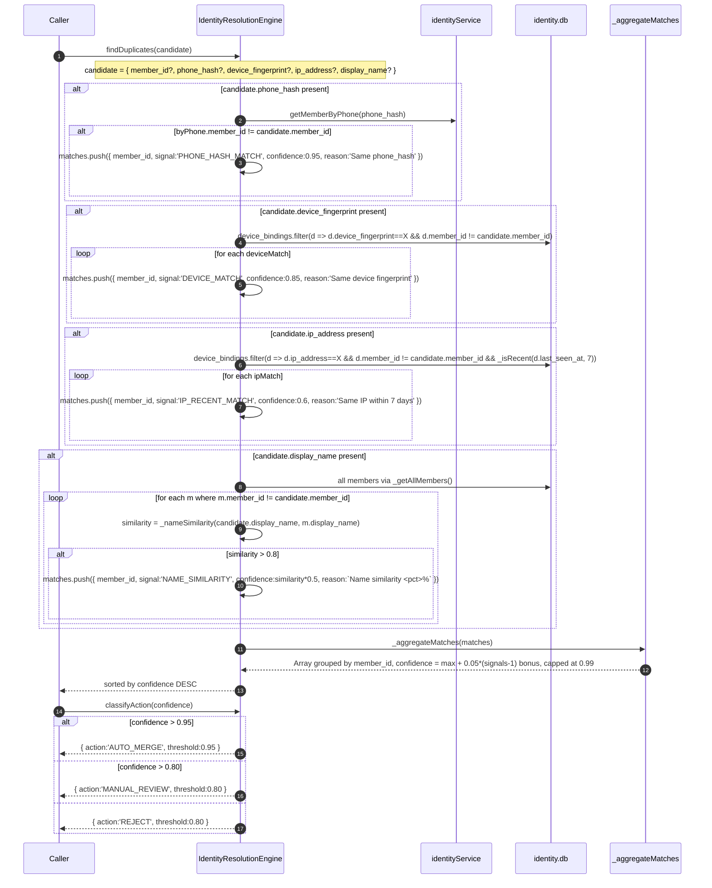
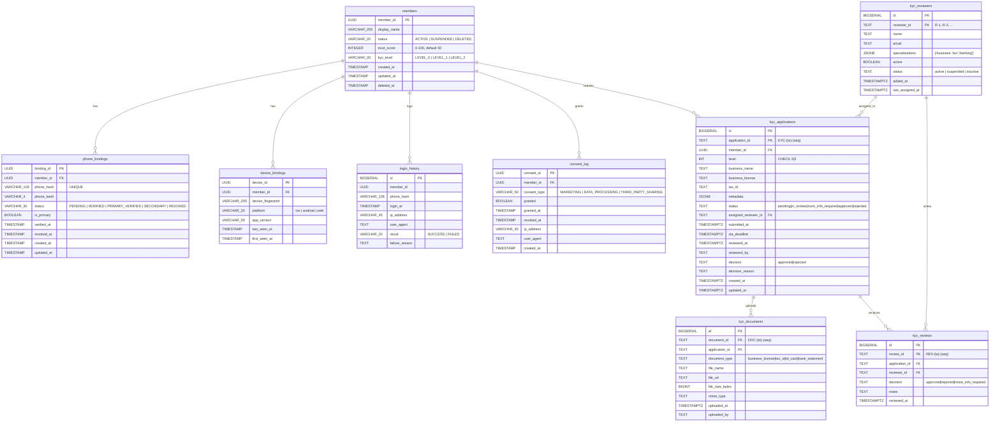
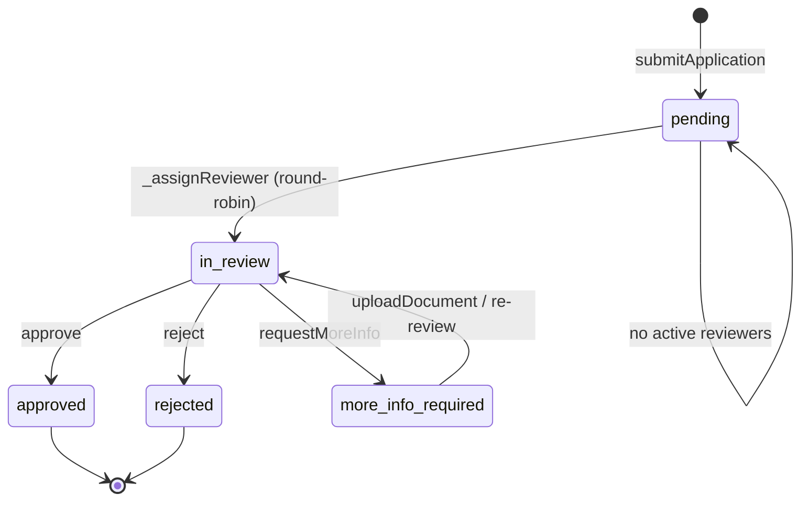
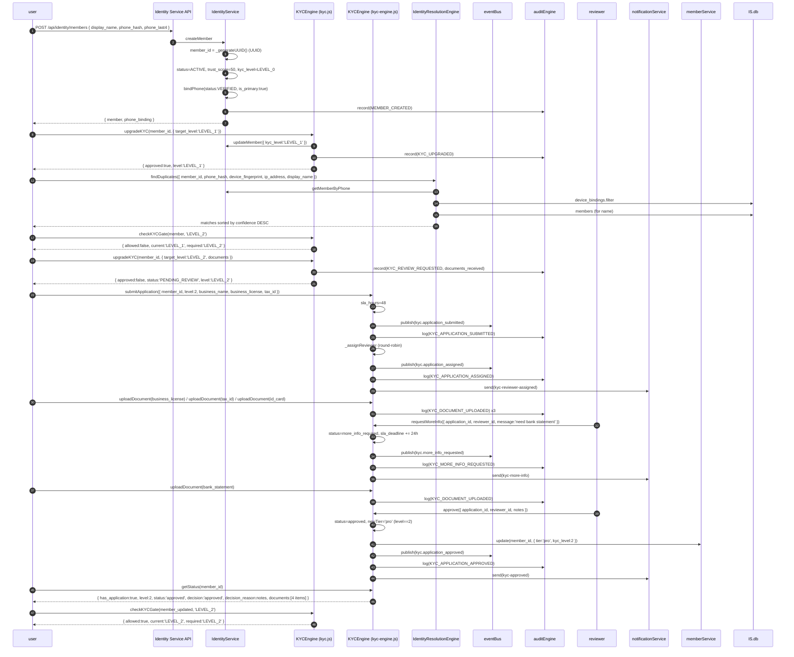
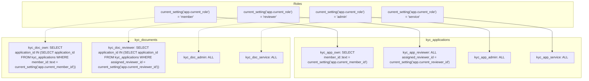
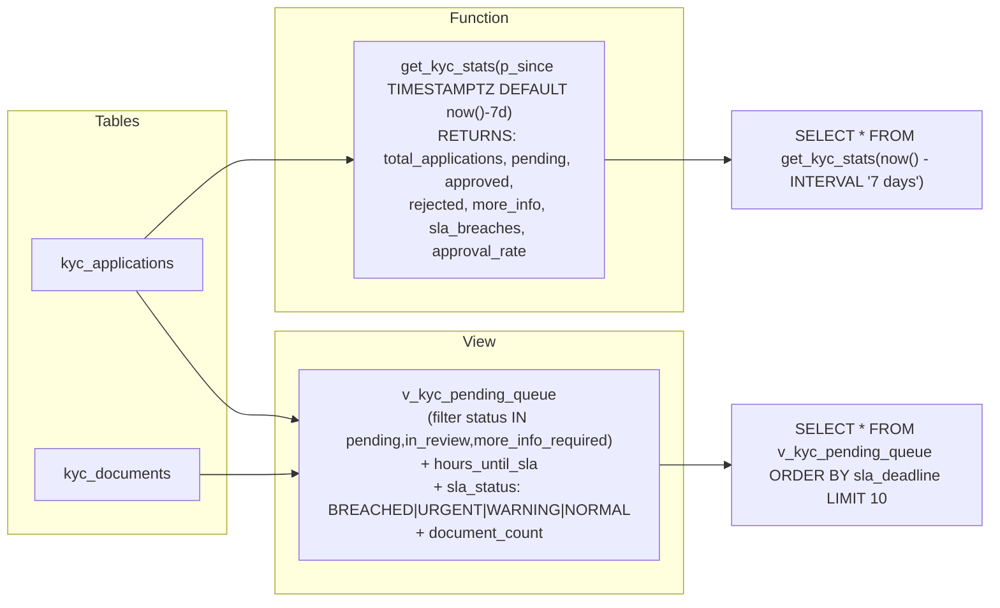
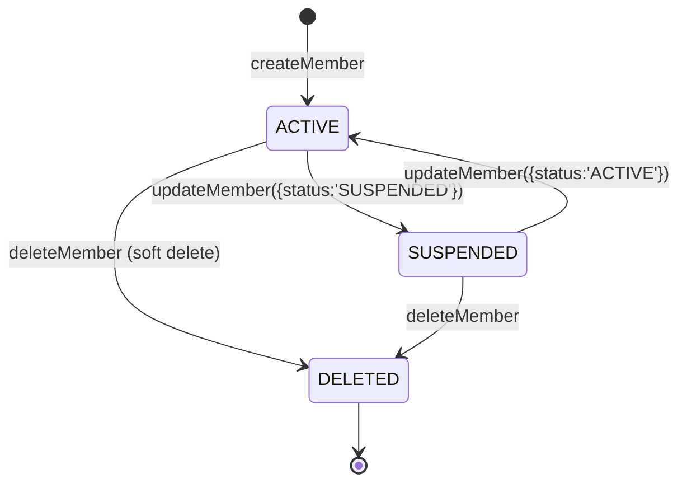
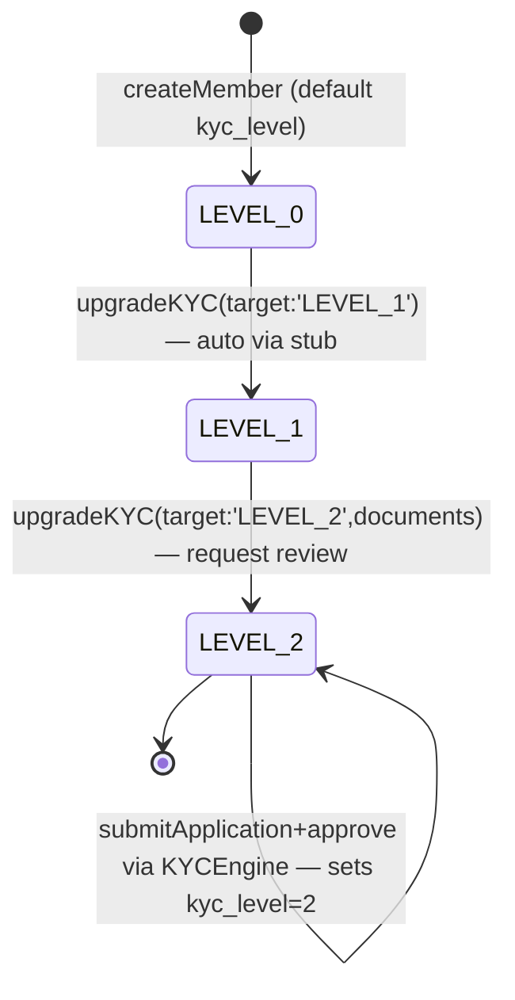
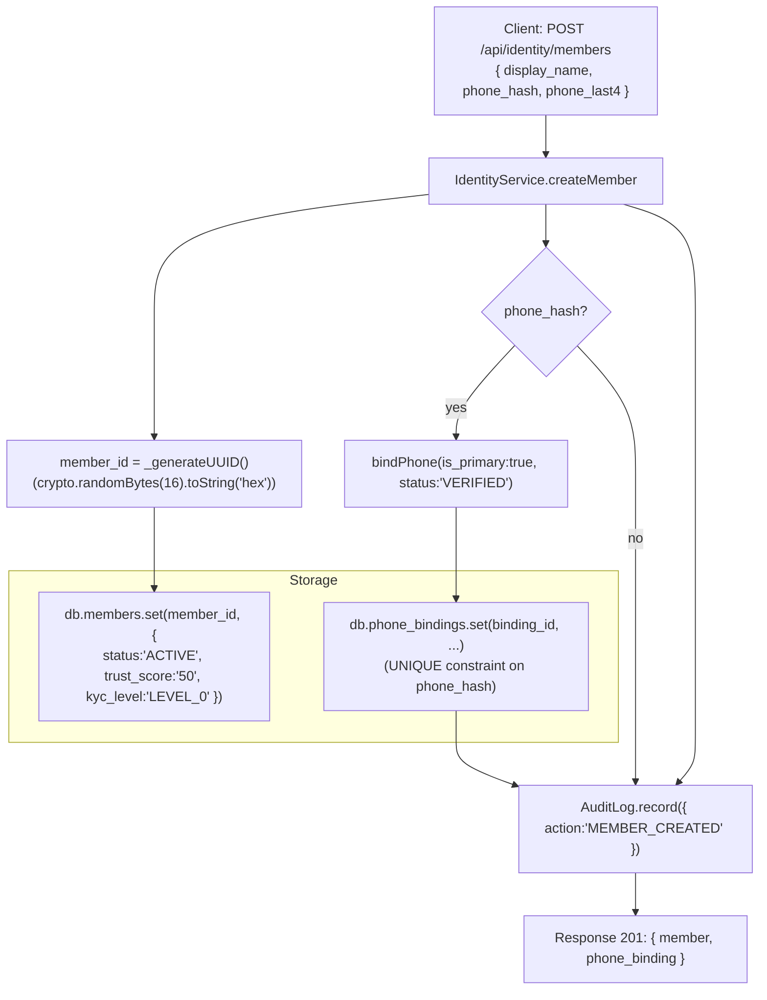

# Identity + KYC End-to-End — Code Trace (Mermaid, no interpretation)

> **Source files (read-only trace):**
> - `apps/identity-service/member.js` — IdentityService (Member, Phone, Consent)
> - `apps/identity-service/server.js` — HTTP API (11 endpoints)
> - `apps/engine/kyc-engine.js` — KYCEngine (10 methods, L2/L3)
> - `apps/engine/kyc.js` — RFC-001 stub (L0/L1)
> - `apps/engine/identity-resolution.js` — duplicate detection
> - `sql/migrations/2026-07-07-p0-identity-service.sql` — members, phone_bindings, device_bindings, login_history, consent_log
> - `sql/migrations/2026-07-07-phase-e-pf16-kyc.sql` — kyc_reviewers, kyc_applications, kyc_documents, kyc_reviews, v_kyc_pending_queue, get_kyc_stats()

> **All names (table, column, method, event, type) are taken verbatim from source code.**

---

## 1. Member lifecycle (IdentityService)

```mermaid
sequenceDiagram
    autonumber
    participant C as Client
    participant API as Express
    participant IS as IdentityService
    participant DB as db (Map)
    participant AL as AuditLog

    C->>API: POST /api/identity/members { display_name, phone_hash, phone_last4 }
    API->>IS: createMember({ display_name, phone_hash, phone_last4 })
    alt display_name missing
        IS-->>API: throw 'display_name is required'
        API-->>C: 400
    end
    IS->>IS: member_id = _generateUUID()  // 'usr_<32hex>'
    IS->>DB: members.set(member_id, { member_id, display_name, status:'ACTIVE', trust_score:'50', kyc_level:'LEVEL_0', created_at, updated_at })

    alt phone_hash provided
        IS->>IS: bindPhone({ member_id, phone_hash, phone_last4, is_primary:true, status:'VERIFIED' })
        IS->>DB: phone_bindings filter phone_hash → existingBinding
        alt existingBinding and existingBinding.member_id != member_id
            IS-->>API: throw 'PHONE_ALREADY_BOUND_TO_ANOTHER_MEMBER'
        end
        alt is_primary
            loop for each b where b.member_id==member_id and b.is_primary
                IS->>DB: b.is_primary=false; b.status = b.status.replace('PRIMARY','SECONDARY')
            end
        end
        IS->>IS: binding_id = _generateUUID()
        IS->>DB: phone_bindings.set(binding_id, { binding_id, member_id, phone_hash, phone_last4, status, is_primary, created_at, verified_at: status=='VERIFIED' ? now : null })
        IS->>AL: record({ action:'PHONE_BOUND', binding_id, member_id, phone_last4, is_primary, timestamp })
    end

    IS->>AL: record({ action:'MEMBER_CREATED', member_id, display_name, timestamp })
    IS-->>API: { member, phone_binding }
    API-->>C: 201
```

```mermaid
sequenceDiagram
    autonumber
    participant C as Client
    participant API as Express
    participant IS as IdentityService
    participant DB as db (Map)
    participant AL as AuditLog

    C->>API: PATCH /api/identity/members/:member_id (body)
    API->>IS: updateMember(member_id, updates)
    IS->>DB: members.get(member_id)
    alt not found
        IS-->>API: throw 'MEMBER_NOT_FOUND'
        API-->>C: 400
    end
    alt member.status == 'DELETED'
        IS-->>API: throw 'MEMBER_DELETED'
        API-->>C: 400
    end
    IS->>IS: allowed = ['display_name', 'kyc_level', 'status']
    IS->>IS: safeUpdates = pick(updates, allowed)
    IS->>DB: Object.assign(member, safeUpdates, { updated_at: now })
    IS->>AL: record({ action:'MEMBER_UPDATED', member_id, updates:safeUpdates, timestamp })
    IS-->>API: member
    API-->>C: 200

    C->>API: DELETE /api/identity/members/:member_id
    API->>IS: deleteMember(member_id)
    IS->>DB: members.get(member_id)
    alt not found
        IS-->>API: throw 'MEMBER_NOT_FOUND'
    end
    IS->>DB: member.status='DELETED'; member.deleted_at=now; member.updated_at=now
    IS->>AL: record({ action:'MEMBER_DELETED', member_id, timestamp })
    IS-->>API: member
    API-->>C: 200
```

---

## 2. Phone bindings + Consent

```mermaid
sequenceDiagram
    autonumber
    participant C as Client
    participant API as Express
    participant IS as IdentityService
    participant DB as db (Map)
    participant AL as AuditLog

    C->>API: POST /api/identity/phone-bindings { member_id, phone_hash, phone_last4, is_primary, status }
    API->>IS: bindPhone({ member_id, phone_hash, phone_last4, is_primary=false, status='PENDING' })
    alt member_id or phone_hash missing
        IS-->>API: throw 'member_id and phone_hash are required'
    end
    IS->>DB: members.get(member_id)
    alt not found
        IS-->>API: throw 'MEMBER_NOT_FOUND'
    end
    IS->>DB: phone_bindings filter phone_hash → existingBinding
    alt existingBinding and existingBinding.member_id != member_id
        IS-->>API: throw 'PHONE_ALREADY_BOUND_TO_ANOTHER_MEMBER'
    end
    alt is_primary
        loop for each b where b.member_id==member_id and b.is_primary
            IS->>DB: b.is_primary=false; b.status=b.status.replace('PRIMARY','SECONDARY')
        end
    end
    IS->>IS: binding_id=_generateUUID()
    IS->>DB: phone_bindings.set(binding_id, { binding_id, member_id, phone_hash, phone_last4:phone_last4||phone_hash.slice(-4), status, is_primary, created_at, verified_at: status=='VERIFIED'?now:null })
    IS->>AL: record({ action:'PHONE_BOUND', binding_id, member_id, phone_last4, is_primary, timestamp })
    IS-->>API: binding
    API-->>C: 201

    C->>API: GET /api/identity/members/:member_id/phones
    API->>IS: getPhonesForMember(member_id)
    IS->>DB: phone_bindings.filter(b.member_id==member_id)
    IS-->>API: array
    API-->>C: 200 { phones }

    C->>API: DELETE /api/identity/phone-bindings/:binding_id
    API->>IS: unbindPhone(binding_id)
    IS->>DB: phone_bindings.get(binding_id)
    alt not found
        IS-->>API: throw 'BINDING_NOT_FOUND'
    end
    alt binding.is_primary
        IS-->>API: throw 'CANNOT_REMOVE_PRIMARY_PHONE'
    end
    IS->>DB: phone_bindings.delete(binding_id)
    IS->>AL: record({ action:'PHONE_UNBOUND', binding_id, member_id:binding.member_id, timestamp })
    IS-->>API: { success:true }
    API-->>C: 200

    Note over C,AL: Consent
    C->>API: POST /api/identity/consents { member_id, consent_type, granted }
    API->>IS: recordConsent({ member_id, consent_type, granted })
    alt member_id or consent_type missing
        IS-->>API: throw 'member_id and consent_type are required'
    end
    IS->>IS: consent_id=_generateUUID()
    IS->>DB: consents.set(consent_id, { consent_id, member_id, consent_type, granted, granted_at: granted?now:null, revoked_at: !granted?now:null })
    IS->>AL: record({ action:'CONSENT_RECORDED', member_id, consent_type, granted, timestamp })
    IS-->>API: consent
    API-->>C: 201

    C->>API: DELETE /api/identity/consents/:consent_id
    API->>IS: revokeConsent(consent_id)
    IS->>DB: consents.get(consent_id)
    alt not found
        IS-->>API: throw 'CONSENT_NOT_FOUND'
    end
    alt !consent.granted
        IS-->>API: throw 'CONSENT_ALREADY_REVOKED'
    end
    IS->>DB: consent.granted=false; consent.revoked_at=now
    IS-->>API: consent
    API-->>C: 200
```

---

## 3. KYC L0 → L1 → L2/L3 progression (kyc.js stub + kyc-engine.js)

```mermaid
sequenceDiagram
    autonumber
    participant U as user
    participant KYC0 as KYCEngine (kyc.js stub)
    participant KYC2 as KYCEngine (kyc-engine.js)
    participant ID as identityService
    participant Bus as eventBus
    participant Audit as auditEngine
    participant Notif as notificationService
    participant Mem as memberService

    Note over U,Mem: Level 0 → Level 1 (auto, via stub)
    U->>KYC0: upgradeKYC(member_id, { target_level:'LEVEL_1' })
    KYC0->>ID: getMember(member_id)
    alt member not found
        KYC0-->>U: throw 'MEMBER_NOT_FOUND'
    end
    alt target_level not in [LEVEL_0, LEVEL_1, LEVEL_2]
        KYC0-->>U: throw 'INVALID_KYC_LEVEL'
    end
    KYC0->>ID: updateMember(member_id, { kyc_level:'LEVEL_1' })
    KYC0->>Audit: record({ action:'KYC_UPGRADED', member_id, from:currentLevel, to:'LEVEL_1' })
    KYC0-->>U: return { approved:true, level:'LEVEL_1' }

    Note over U,Mem: Level 1 → Level 2 (manual review)
    U->>KYC0: upgradeKYC(member_id, { target_level:'LEVEL_2', documents:{...} })
    alt !documents
        KYC0-->>U: throw 'LEVEL_2_REQUIRES_DOCUMENTS'
    end
    KYC0->>Audit: record({ action:'KYC_REVIEW_REQUESTED', member_id, documents_received:Object.keys(documents).length })
    KYC0-->>U: return { approved:false, status:'PENDING_REVIEW', level:'LEVEL_2' }

    Note over U,Mem: Real L2 flow via KYCEngine (kyc-engine.js)
    U->>KYC2: submitApplication({ member_id, level:2, business_name, business_license, tax_id, actor:'user' })
    KYC2->>KYC2: check existing pending where member_id==X AND level==Y AND status in [pending, in_review, more_info_required]
    KYC2->>KYC2: sla_hours=48; sla_deadline=now+48h
    KYC2->>Bus: publish('kyc.application_submitted')
    KYC2->>Audit: log(KYC_APPLICATION_SUBMITTED)
    KYC2->>KYC2: _assignReviewer() round-robin
    KYC2->>Bus: publish('kyc.application_assigned')
    KYC2->>Audit: log(KYC_APPLICATION_ASSIGNED)
    KYC2->>Notif: send({ template_id:'kyc-reviewer-assigned' })
    KYC2-->>U: return application

    U->>KYC2: uploadDocument({ application_id, document_type:'business_license', file_name, file_url })
    KYC2->>Audit: log(KYC_DOCUMENT_UPLOADED)

    Rev->>KYC2: approve({ application_id, reviewer_id, notes })
    KYC2->>Mem: update(member_id, { tier:'pro', kyc_level:app.level })
    KYC2->>Bus: publish('kyc.application_approved')
    KYC2->>Audit: log(KYC_APPLICATION_APPROVED)
    KYC2->>Notif: send({ template_id:'kyc-approved' })

    Note over U,Mem: Gate check
    U->>KYC0: checkKYCGate(member, 'LEVEL_2')
    KYC0->>KYC0: memberLevel = {LEVEL_0:0,LEVEL_1:1,LEVEL_2:2}[member.kyc_level || 'LEVEL_0']
    KYC0-->>U: return { allowed: memberLevel >= required, current, required }
```

---

## 4. Identity resolution (duplicate detection)



---

## 5. Database ER diagram (Identity + KYC)



---

## 6. KYC state machine



---

## 7. End-to-end trace (signup → KYC L2 approved)



---

## 8. RLS policies (kyc-applications + kyc-documents)



---

## 9. Views + Functions (DB)



---

## 10. Event + Audit + Notification cross-reference

| Event topic (eventBus) | Audit event_type | Notification template_id | File:line |
|---|---|---|---|
| `kyc.application_submitted` | `KYC_APPLICATION_SUBMITTED` | — | kyc-engine.js:65,71 |
| `kyc.application_assigned` | `KYC_APPLICATION_ASSIGNED` (actor:'system') | `kyc-reviewer-assigned` | kyc-engine.js:139,144,148 |
| `kyc.application_approved` | `KYC_APPLICATION_APPROVED` | `kyc-approved` | kyc-engine.js:188,192,196 |
| `kyc.application_rejected` | `KYC_APPLICATION_REJECTED` | `kyc-rejected` | kyc-engine.js:233,237,241 |
| `kyc.more_info_requested` | `KYC_MORE_INFO_REQUESTED` | `kyc-more-info` | kyc-engine.js:281,285,289 |
| — | `KYC_DOCUMENT_UPLOADED` | — | kyc-engine.js:107 |
| — | `KYC_REVIEWER_ADDED` | — | kyc-engine.js:347 |
| — | `MEMBER_CREATED` (RFC-001) | — | member.js:104 |
| — | `MEMBER_UPDATED` | — | member.js:171 |
| — | `MEMBER_DELETED` | — | member.js:190 |
| — | `PHONE_BOUND` | — | member.js:241 |
| — | `PHONE_UNBOUND` | — | member.js:265 |
| — | `CONSENT_RECORDED` | — | member.js:300 |
| — | `KYC_UPGRADED` (RFC-001 stub) | — | kyc.js:37 |
| — | `KYC_REVIEW_REQUESTED` (RFC-001 stub) | — | kyc.js:46 |

## 11. Member.status state machine



## 12. KYC level progression



## 13. Identity data flow (signup)


