# KYC/Verify Flow — Code Trace (English, no interpretation)

> **Source files (read-only trace):**
> - `apps/engine/kyc-engine.js` (369 lines, 10 methods)
> - `apps/engine/identity-resolution.js` (186 lines)
> - `apps/engine/kyc.js` (87 lines, RFC-001 stub)
> - `apps/identity-service/server.js` (137 lines, 11 endpoints)
> - `apps/identity-service/member.js`

> **Method names, event names, file paths are taken verbatim from source code.**

---

## 1. KYCEngine.submitApplication() — `kyc-engine.js:32-78`

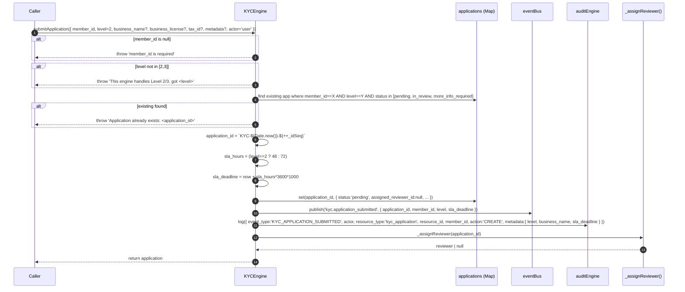

---

## 2. KYCEngine.uploadDocument() — `kyc-engine.js:84-114`

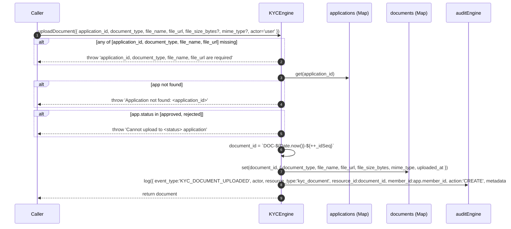

---

## 3. KYCEngine._assignReviewer() — `kyc-engine.js:120-152`

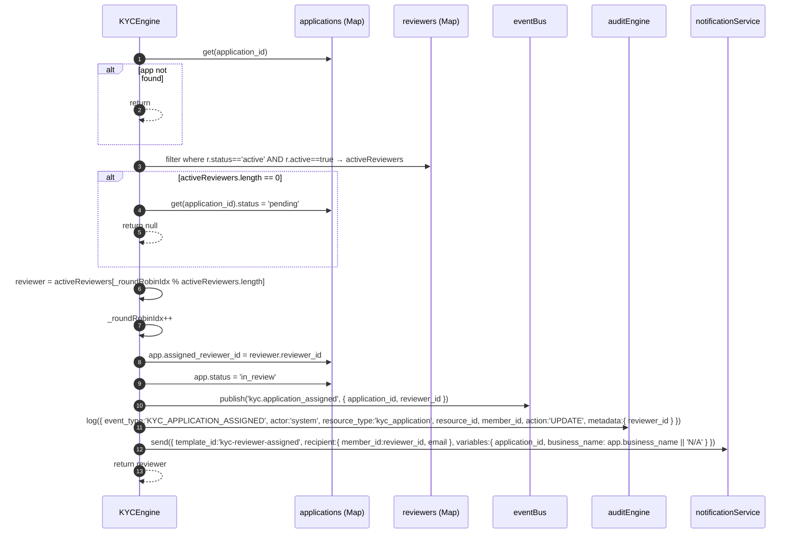

---

## 4. KYCEngine.approve() — `kyc-engine.js:158-200`

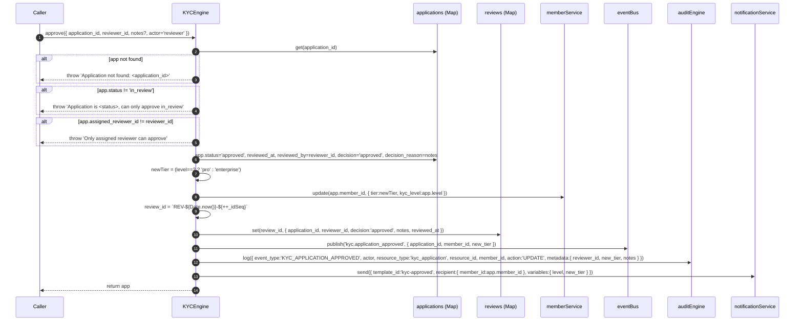

---

## 5. KYCEngine.reject() — `kyc-engine.js:206-244`

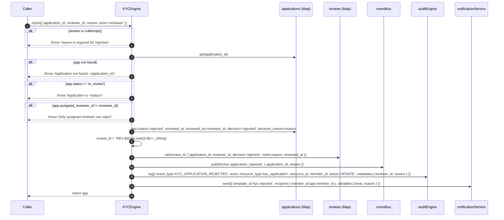

---

## 6. KYCEngine.requestMoreInfo() — `kyc-engine.js:250-293`

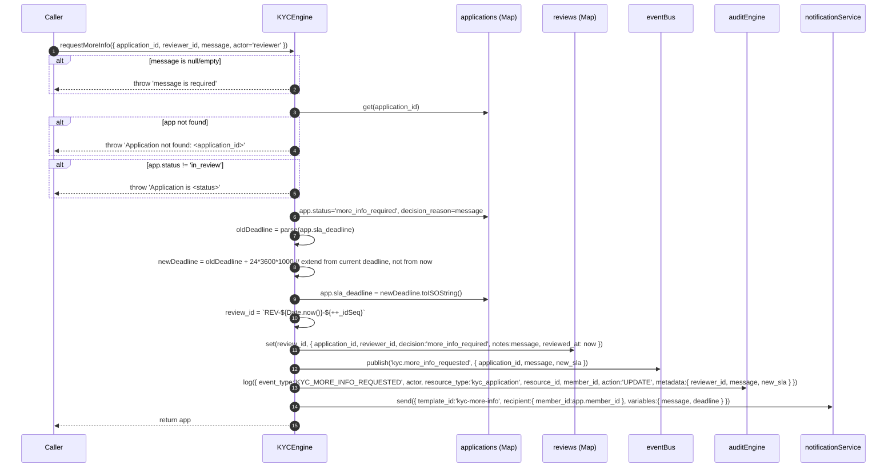

---

## 7. KYCEngine.getStatus() / getReviewerQueue() / getStats()

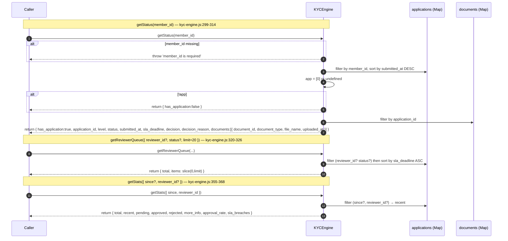

---

## 8. IdentityResolutionEngine.findDuplicates() — `identity-resolution.js:18-104`

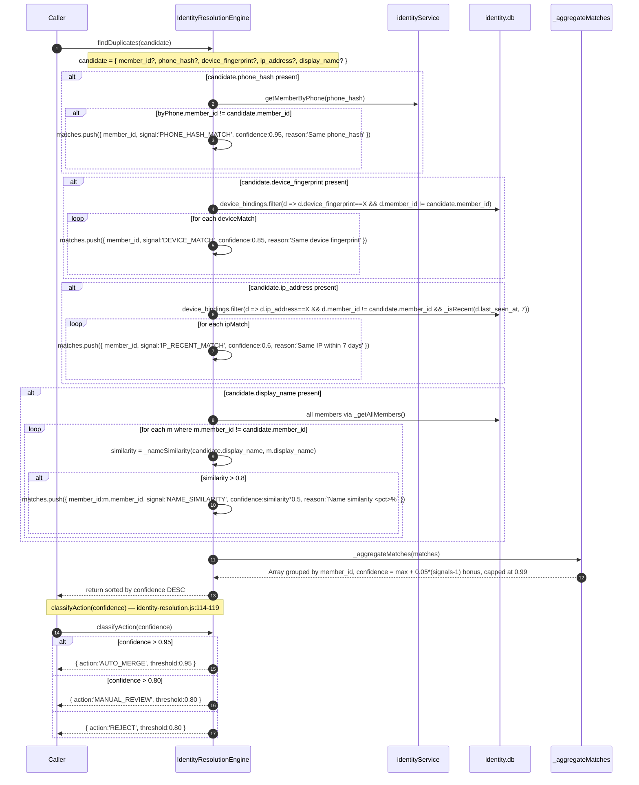

---

## 9. RFC-001 stub kyc.js — `kyc.js:13-83`

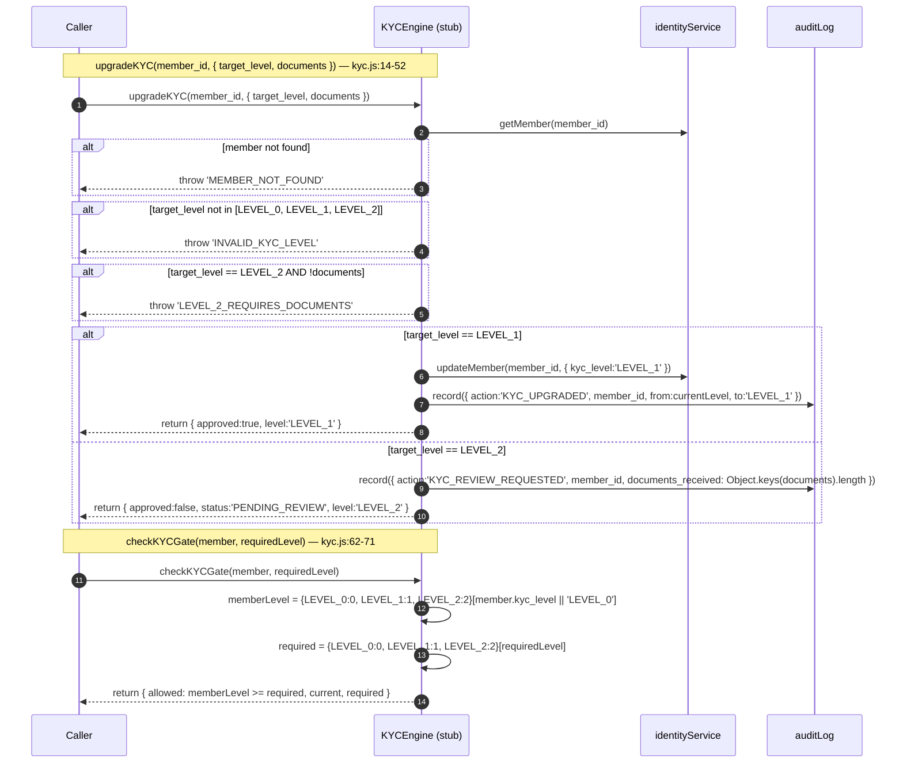

---

## 10. IdentityService HTTP API — `server.js:25-108`

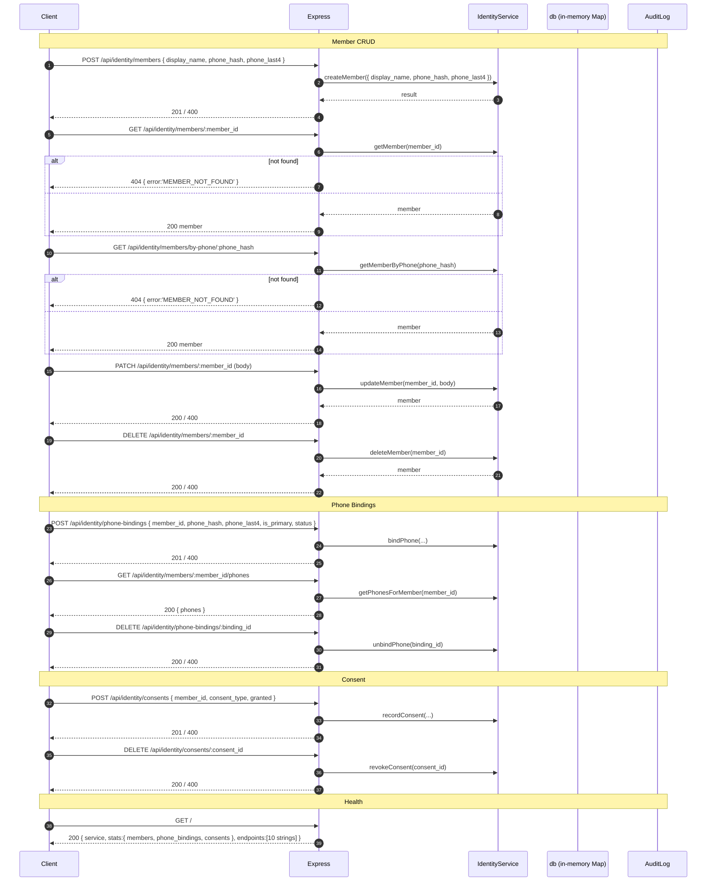

---

## End-to-End Trace (KYC L2 happy path)

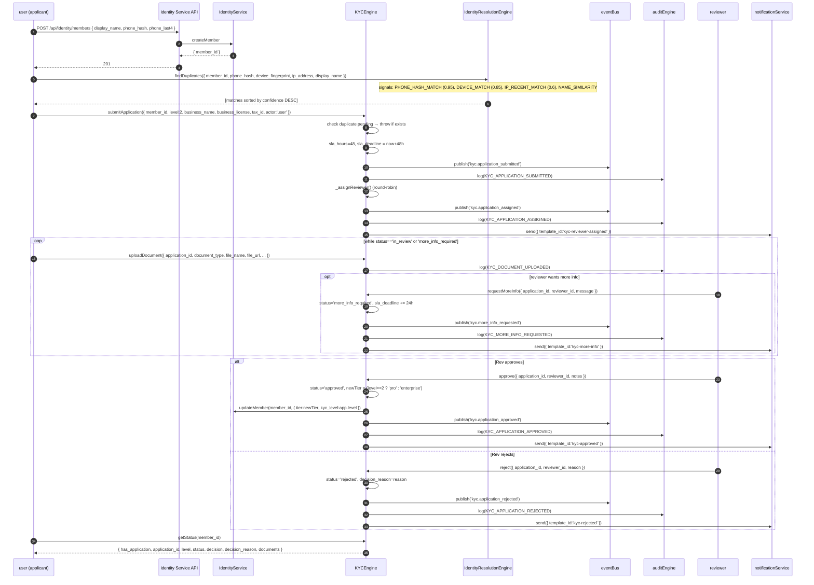

---

## Event Topics (eventBus)

| Topic | Published by | File:line |
|---|---|---|
| `kyc.application_submitted` | `KYCEngine.submitApplication` | kyc-engine.js:65 |
| `kyc.application_assigned` | `KYCEngine._assignReviewer` | kyc-engine.js:139 |
| `kyc.application_approved` | `KYCEngine.approve` | kyc-engine.js:188 |
| `kyc.application_rejected` | `KYCEngine.reject` | kyc-engine.js:233 |
| `kyc.more_info_requested` | `KYCEngine.requestMoreInfo` | kyc-engine.js:281 |

## Audit Event Types (auditEngine)

| event_type | Action | File:line |
|---|---|---|
| `KYC_APPLICATION_SUBMITTED` | CREATE | kyc-engine.js:71 |
| `KYC_APPLICATION_ASSIGNED` | UPDATE (actor:'system') | kyc-engine.js:144 |
| `KYC_APPLICATION_APPROVED` | UPDATE | kyc-engine.js:192 |
| `KYC_APPLICATION_REJECTED` | UPDATE | kyc-engine.js:237 |
| `KYC_MORE_INFO_REQUESTED` | UPDATE | kyc-engine.js:285 |
| `KYC_DOCUMENT_UPLOADED` | CREATE | kyc-engine.js:107 |
| `KYC_REVIEWER_ADDED` | CREATE | kyc-engine.js:347 |
| `KYC_UPGRADED` | (RFC-001 stub) | kyc.js:37 |
| `KYC_REVIEW_REQUESTED` | (RFC-001 stub) | kyc.js:46 |

## Notification Templates (notificationService.send)

| template_id | Recipient | Triggered by |
|---|---|---|
| `kyc-reviewer-assigned` | reviewer (member_id + email) | _assignReviewer |
| `kyc-approved` | applicant (member_id) | approve |
| `kyc-rejected` | applicant (member_id) | reject |
| `kyc-more-info` | applicant (member_id) | requestMoreInfo |

## IdentityResolution confidence thresholds (`classifyAction`)

| confidence | action | threshold |
|---|---|---|
| > 0.95 | `AUTO_MERGE` | 0.95 |
| > 0.80 | `MANUAL_REVIEW` | 0.80 |
| ≤ 0.80 | `REJECT` | 0.80 |

## IdentityResolution signal weights

| signal | confidence | notes |
|---|---|---|
| `PHONE_HASH_MATCH` | 0.95 | via `identityService.getMemberByPhone` |
| `DEVICE_MATCH` | 0.85 | via `db.device_bindings` |
| `IP_RECENT_MATCH` | 0.60 | within 7 days (`_isRecent(d.last_seen_at, 7)`) |
| `NAME_SIMILARITY` | similarity*0.5 (max 0.4) | Levenshtein > 0.8 |

## KYC L2/L3 SLA constants

| level | sla_hours | source |
|---|---|---|
| 2 | 48 | kyc-engine.js:49 (`level === 2 ? 48 : 72`) |
| 3 | 72 | kyc-engine.js:49 |
| more_info extension | +24h from current `sla_deadline` | kyc-engine.js:266-269 |

## KYC application state machine

```
              submitApplication
                     │
                     ▼
              ┌─────────────┐
              │   pending   │  ← _assignReviewer() with no active reviewers
              └──────┬──────┘
                     │ _assignReviewer() (round-robin)
                     ▼
              ┌─────────────┐
              │  in_review  │  ← uploaded docs; reviewer decides
              └──┬──────┬───┘
       requestMoreInfo   │
                 │       │
                 ▼       │
       ┌────────────────┐ │
       │more_info_required│ │ approve
       │   (SLA +24h)   │ │
       └────────┬───────┘ │
                │         │
                │         ▼
                │  ┌─────────────┐
                │  │  approved   │  → members.update({ tier:pro/enterprise })
                │  └─────────────┘
                │         ▲
                │         │ reject
                │         │
                │  ┌─────────────┐
                └─▶│  rejected   │
                   └─────────────┘
```

## IdentityService endpoints (`server.js:122-133`)

| Method | Path | Body / Params | Handler |
|---|---|---|---|
| POST | `/api/identity/members` | `{ display_name, phone_hash, phone_last4 }` | `identity.createMember` |
| GET | `/api/identity/members/:member_id` | — | `identity.getMember` (404 if not found) |
| GET | `/api/identity/members/by-phone/:phone_hash` | — | `identity.getMemberByPhone` (404 if not found) |
| PATCH | `/api/identity/members/:member_id` | partial member fields | `identity.updateMember` |
| DELETE | `/api/identity/members/:member_id` | — | `identity.deleteMember` |
| POST | `/api/identity/phone-bindings` | `{ member_id, phone_hash, phone_last4, is_primary, status }` | `identity.bindPhone` |
| GET | `/api/identity/members/:member_id/phones` | — | `identity.getPhonesForMember` |
| DELETE | `/api/identity/phone-bindings/:binding_id` | — | `identity.unbindPhone` |
| POST | `/api/identity/consents` | `{ member_id, consent_type, granted }` | `identity.recordConsent` |
| DELETE | `/api/identity/consents/:consent_id` | — | `identity.revokeConsent` |
| GET | `/` | — | health check (service + stats + endpoint list) |

Default port: `process.env.PORT || 3002` (`server.js:135`).
